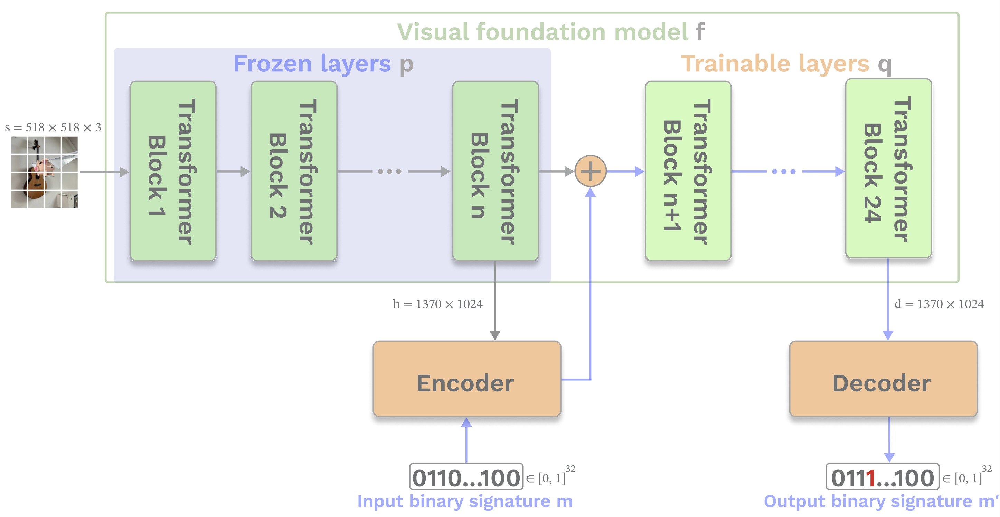

# ExpressPrint: A Tool to Watermark Visual Foundation Models

ExpressPrint is the first watermarking method designed specifically for Vision Transformers (ViTs). It leverages massive internal activations to embed robust and stealthy watermarks into large visual foundation models.

<p align="center">
  
</p>

## 📦 Installation
Install ExpressPrint directly from GitHub:
```bash
pip install git+https://github.com/wianluna/expressprint.git
```

## ⚙️ Model Compatibility

To integrate your own Vision Transformer with ExpressPrint, create a custom wrapper class that inherits from [`BaseModel`](./expressprint/models/model_pattern.py).

This wrapper should implement the following methods:

- **`build_model(self, **kwargs)`**  
  Returns a pretrained ViT model (`torch.nn.Module`), such as CLIP or DINOv2.

- **`get_blocks(self, **kwargs)`**  
  Returns a list of internal transformer blocks used for activation analysis and watermark injection.

- **`get_hidden_size(self, **kwargs)`**  
  Returns the dimensionality of the internal hidden representations (e.g., 768 or 1024).

- **`get_data_transforms(self) -> tuple[Compose, Compose]`**  
  Returns a pair of `torchvision.transforms.Compose` objects:  
  **(train_transforms, val_transforms)** — used during training and evaluation.


## 📁 Dataset Preparation
* Download and prepare the [ImageNet](https://www.image-net.org/index.php) dataset, use this [helper script](https://raw.githubusercontent.com/soumith/imagenetloader.torch/master/valprep.sh) from the official PyTorch repository to move the validation subset into the labeled subfolders.

* For Step 3: Fine-tuning, download the [ecommerce_product_images_18K](https://www.kaggle.com/datasets/fatihkgg/ecommerce-product-images-18k) dataset.

Don't forget to update the dataset paths in your config file accordingly.

## 🔍 Step 1: Find the Expressive Block

To determine the best injection point, analyze internal activations across all transformer blocks.

Use the [`ActivationsAnalyzer`](./expressprint/methods/massive_activations.py) to:
- Pass a set of natural images through the model,
- Collect feature activations from each transformer block,
- Compute the **mean of the top-5 absolute activation values** per block.

The block that shows the first **sharp increase in activation magnitude** is selected as the **expressive block** — an optimal location for injecting the watermark.

Example: [find_expressive_block.py](./expressprint/runners/find_expressive_block.py)


## 🔧 Step 2: Embed watermark

Create the encoder and decoder using [create_wm_models](./expressprint/models/), then run the training loop via [ExpressPrintTrainer](./expressprint/trainers/wm_trainer.py):

```python
wm_encoder, wm_decoder = create_wm_models(
    watermark_size=WATERMARK_SIZE,
    feature_dim=model.get_hidden_size()
)

trainer = ExpressPrintTrainer(
    model=model,
    wm_encoder=wm_encoder,
    wm_decoder=wm_decoder,
    wm_block_idx=expressive_block,
    log_path="../demos_logs/wm",
    num_epochs=5
)
```
Example: [embed_watermark.py](./expressprint/runners/embed_watermark.py)
```bash
python expressprint/runners/embed_watermark.py --config configs/watermarking/expressprint_clip.yaml
```

## 🔄 Step 3: Fine-tune

To simulate realistic deployment, fine-tune the watermarked model on a downstream task and test watermark recovery in the next Step:

Example: [classification/run.py](./expressprint/experiments/classification/run.py)
```bash
python expressprint/experiments/classification/run.py --config configs/finetuning/ecommerce_cosine.yaml
```

## ✅ Step 4: Evaluate Watermark

1. Prepare the [evaluation dataset](./expressprint/datasets/wm_dataset.py):

```python
wm_dataset = WatermarkDataLoader(
    data_dir="../../imagenet/ILSVRC/Data/CLS-LOC",
    json_path="../demos_logs/wm/wm_test_set.json"
).get_val_loader(
    batch_size=BATCH_SIZE,
    num_workers=NUM_WORKERS,
    val_transforms=val_transform,
)
```

2. Create the [watermark evaluation module](./expressprint/methods/expressprint.py) and run the test:
```python
wm = ExpressPrintWatermarker(
    model=model,
    encoder=wm_encoder,
    decoder=wm_decoder,
    wm_block_idx=expressive_block,
    wm_size=WATERMARK_SIZE
)

wm.evaluate(wm_dataset)
```
